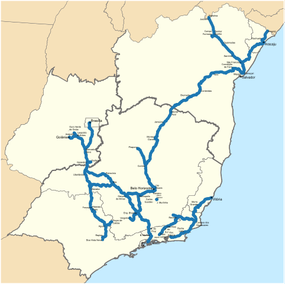

# Introdução

A série escolhida refere-se ao volume transportado em toneladas úteis pela Ferrovia Centro-Atlântica (FCA). A série vai de 2006 a 2020, com dados mensais, e foi complilada a partir do conjunto de dados abertos da Agência Nacional de Transportes Terrestres --- ANTT, disponíveis [neste link](https://dados.antt.gov.br/dataset/sistema-de-acompanhamento-do-desempenho-operacional-das-concessionarias-siade).

```{r setup, include=FALSE}
knitr::opts_chunk$set(echo = TRUE)
knitr::opts_chunk$set(warning = FALSE)

source("C:/Users/arthu/OneDrive/Documentos/R/Projects/ECST/install_and_load_packages.R")
library(readxl)
library(png)
```



```{r fig, eval=FALSE, include=FALSE}
fig1 <- readPNG("malha_fca.png", native = TRUE, info = TRUE)
attr(fig1, "info")
```

# Análise exploratória

```{r dados}
antt <- read_excel("C:/Users/arthu/OneDrive/Documentos/R/Projects/ECST/Atividade ECST/antt/producao_origem_destino.xlsx")
str(antt)

fca <- antt %>% 
  dplyr::filter(Ferrovia == "FCA") %>% 
  dplyr::select(Mes_Ano, TU, TKU) %>% 
  mutate(TU = TU/1000000, TKU = TKU/1000000000) %>%
  group_by(Mes_Ano) %>% 
  summarise_all(list(sum))

fca <- xts(fca[,-1], order.by = as.POSIXct(fca$Mes_Ano))

prod <- antt %>% 
  dplyr::filter(Ferrovia == "FCA") %>% 
  dplyr::select(Mercadoria_ANTT, TU, TKU) %>% 
  group_by(Mercadoria_ANTT) %>% 
  summarise(TU = sum(TU), TKU = sum(TKU)) %>% 
  mutate(TU = TU/1000000, TKU = TKU/1000000000) %>% 
  mutate(`Part. (%)` = 100*TU/sum(TU)) %>% 
  arrange(desc(`Part. (%)`))

knitr::kable(prod[1:10,], digits = 2, align = "c") 
```

As estatísticas demonstram que os principais produtos transportados pela FCA são commodities agrícolas e minerais. Assim, é plausível imaginar que a série apresente alguma relação com o ciclo de produção de alguns desses bens, como a soja e o milho, bem como com as dinâmicas macroeconômicas dos países exportadores.

```{r plot}
ggplot(data = fca, aes(time(fca), TU, TKU)) +
  geom_line(color = "#FEB712") +
  theme(axis.text.x = element_text(angle = 90, hjust = 1)) +
  theme_classic() +
  labs(title = "Carga transportada pela FCA", subtitle = "Em milhões de toneladas úteis (TUs)", x = "Tempo (anos)", y = "Volume (TU*10^6)", caption = "Fonte: ANTT")
```

```{r log}
fca_log <- log(fca)[,1]

ggplot(data = fca_log, aes(time(fca_log), TU)) +
  geom_line(color = "#FEB712") +
  theme(axis.text.x = element_text(angle = 90, hjust = 1)) +
  theme_classic() +
  labs(title = "Carga transportada pela FCA", subtitle = "Em milhões de toneladas úteis (TUs) em log", x = "Tempo (anos)", y = "Volume log(TU*10^6)", caption = "Fonte: ANTT")
```

## Tendência e sazonalidade

```{r decomp}
tu_ts <- fca_log
tu_ts <- ts(tu_ts, start = c(2006,01,01), end = c(2019,12,01), frequency = 1)
tu_ts <- ts(tu_ts, start = c(2006,01,01), end = c(2019,12,01), frequency = 12)
decomp <- stl(tu_ts, "periodic")
colnames(decomp$time.series) = c("sazonal.","tendência","restante")
plot(decomp)
```

A decomposição da série indica a presença de sazonalidade e tendência semelhantes a uma senóide, com picos e vales, convergente com a intuição dos ciclos produtivos (oferta) e econômicos (demanda).

## Teste de raiz unitária

$H_0$: presença de raiz unitária

$H_1$: ausença de raiz unitária

```{r adftest}
# passeio aleatório
fUnitRoots::adfTest(fca_log, lags =12, type = c("nc"))

# passeio aleatório com drift
fUnitRoots::adfTest(fca_log, lags =12, type = c("c"))

# passeio aleatório com constante e tendência
fUnitRoots::adfTest(fca_log, lags =12, type = c("ct"))
```

O teste para presença de raiz unitária considerando um modelo de passeio aleatório não é rejeitado, com p-valor de aproximadamente 0,92. Sob a premissa de passeio aleatório com drift, o p-valor diminui para cerca de 0,34, ainda não rejeitado. Já no caso do passeio aleatório com constante e tendência, é possível rejeitar a possibilidade de raiz unitária a um nível crítico de 5%, o que indica que a série pode se comportar como um passeio aleatório dessa natureza.

# Análise das FAC e FACP

## Modelo original

```{r fac}
fac_logFca <- stats::acf(fca_log, plot = FALSE, na.action = na.pass)

par(mfrow=c(1,1))
plot(fac_logFca)
title("Função de Autocorrelação (FAC)", adj = 0.5, line = 1)
```

O padrão da FAC --- correlação significativa persistente --- indica que a série é não estacionária e, possivelmente, sazonal. Assim, é necessário fazer a primeira diferenciação para expurgar a tendência.

## Uma diferença

```{r fac_dif}
logFca_dif <-timeSeries::diff(fca_log, lag = 1, differences = 1) 

m <- logFca_dif %>% 
  na.omit() %>% 
  mean()
m

logFca_dif %>% 
  na.omit() %>% 
  var()

ggplot(data = logFca_dif, aes(x=time(logFca_dif), y = TU)) +
  geom_line() +
  geom_hline(yintercept = m, color = "#002C5E") +
  labs(title = "Carga transportada pela FCA", subtitle = "Log(TU*10^6) com uma diferença", x = "Tempo (anos)", y = "Volume log(TU*10^6)", caption = "Fonte: ANTT e modelo próprio") +
  theme(axis.text.x = element_text(angle = 90, hjust = 1)) +
  theme_classic()

fac_logFca_dif <- stats::acf(logFca_dif, plot = FALSE, na.action = na.pass)
plot(fac_logFca_dif)
title("Função de Autocorrelação (FAC)", adj = 0.5, line = 1)
```

Após a primeira diferenciação, a série aparenta ter um padrão estacionário. Além disso, sua FAC tem menos lags significativos.

```{r adf_dif}
adfTest(logFca_dif, lags = 12, type = "nc")
adfTest(logFca_dif, lags = 12, type = "c")
adfTest(logFca_dif, lags = 12, type = "ct")
```

Os testes de raiz unitária rejeitam a hipótese de o modelo se comportar como um passeio aleatório.

## Sazonalidade e diferença

```{r saz3}
logFca_dif_saz3 <- timeSeries::diff(timeSeries::diff(fca_log, lag = 1, differences = 1), lag = 3, differences = 1, lag.max = 120)

m <- logFca_dif_saz3 %>% 
  na.omit() %>% 
  mean()
m

logFca_dif_saz3 %>% 
  na.omit() %>% 
  var()

ggplot(data = logFca_dif_saz3, aes(x=time(logFca_dif_saz3), y = TU)) +
  geom_line() +
  labs(title = "Carga transportada pela FCA", subtitle = "Log(TU*10^6) com uma diferença e sazonalidade trimestral", x = "Tempo (anos)", y = "Volume log(TU*10^6)", caption = "Fonte: ANTT e modelo próprio") +
  theme(axis.text.x = element_text(angle = 90, hjust = 1)) +
  theme_classic() +
  geom_hline(yintercept = m, color = "#002C5E")

fac_logFca_dif_saz3 <- stats::acf(logFca_dif_saz3, plot = FALSE, na.action = na.pass)
plot(fac_logFca_dif_saz3)
title("Função de Autocorrelação (FAC)", adj = 0.5, line = 1)
```

```{r adf_saz3}
adfTest(logFca_dif_saz3, lags = 12, type = "nc")
adfTest(logFca_dif_saz3, lags = 12, type = "c")
adfTest(logFca_dif_saz3, lags = 12, type = "ct")
```

```{r saz4, eval=FALSE, include=FALSE}
logFca_dif_saz4 <- timeSeries::diff(timeSeries::diff(fca_log, lag = 1, differences = 1), lag = 5, differences = 1, lag.max = 120)

m <- logFca_dif_saz4 %>% 
  na.omit() %>% 
  mean()
m

logFca_dif_saz4 %>% 
  na.omit() %>% 
  var()

ggplot(data = logFca_dif_saz4, aes(x=time(logFca_dif_saz4), y = TU)) +
  geom_line() +
  labs(title = "Carga transportada pela FCA", subtitle = "Log(TU*10^6) com uma diferença e sazonalidade quadrimestral", x = "Tempo (anos)", y = "Volume log(TU*10^6)", caption = "Fonte: ANTT e modelo próprio") +
  theme(axis.text.x = element_text(angle = 90, hjust = 1)) +
  theme_classic() +
  geom_hline(yintercept = m, color = "#002C5E")

fac_logFca_dif_saz4 <- stats::acf(logFca_dif_saz4, plot = FALSE, na.action = na.pass)
plot(fac_logFca_dif_saz4)
title("Função de Autocorrelação (FAC)", adj = 0.5, line = 1)
```

```{r saz6}
logFca_dif_saz6 <- timeSeries::diff(timeSeries::diff(fca_log, lag = 1, differences = 1), lag = 6, differences = 1, lag.max = 120)

m <- logFca_dif_saz6 %>% 
  na.omit() %>% 
  mean()
m

logFca_dif_saz6 %>% 
  na.omit() %>% 
  var()

ggplot(data = logFca_dif_saz6, aes(x=time(logFca_dif_saz6), y = TU)) +
  geom_line() +
  labs(title = "Carga transportada pela FCA", subtitle = "Log(TU*10^6) com uma diferença e sazonalidade Semestral", x = "Tempo (anos)", y = "Volume log(TU*10^6)", caption = "Fonte: ANTT e modelo próprio") +
  theme(axis.text.x = element_text(angle = 90, hjust = 1)) +
  theme_classic() +
  geom_hline(yintercept = m, color = "#002C5E")

fac_logFca_dif_saz6 <- stats::acf(logFca_dif_saz6, plot = FALSE, na.action = na.pass)
plot(fac_logFca_dif_saz6)
title("Função de Autocorrelação (FAC)", adj = 0.5, line = 1)
```

```{r adf_saz6}
adfTest(logFca_dif_saz6, lags = 12, type = "nc")
adfTest(logFca_dif_saz6, lags = 12, type = "c")
adfTest(logFca_dif_saz6, lags = 12, type = "ct")
```

```{r saz12}
logFca_dif_saz12 <- timeSeries::diff(timeSeries::diff(fca_log, lag = 1, differences = 1), lag = 12, differences = 1, lag.max = 120)

m <- logFca_dif_saz12 %>% 
  na.omit() %>% 
  mean()
m

logFca_dif_saz12 %>% 
  na.omit() %>% 
  var()

ggplot(data = logFca_dif_saz12, aes(x=time(logFca_dif_saz12), y = TU)) +
  geom_line() +
  labs(title = "Carga transportada pela FCA", subtitle = "Log(TU*10^6) com uma diferença e sazonalidade anual", x = "Tempo (anos)", y = "Volume log(TU*10^6)", caption = "Fonte: ANTT e modelo próprio") +
  theme(axis.text.x = element_text(angle = 90, hjust = 1)) +
  theme_classic() +
  geom_hline(yintercept = m, color = "#002C5E")

fac_logFca_dif_saz12 <- stats::acf(logFca_dif_saz12, plot = FALSE, na.action = na.pass)
plot(fac_logFca_dif_saz12)
title("Função de Autocorrelação (FAC)", adj = 0.5, line = 1)
```

```{r adf_saz12}
adfTest(logFca_dif_saz12, lags = 12, type = "nc")
adfTest(logFca_dif_saz12, lags = 12, type = "c")
adfTest(logFca_dif_saz12, lags = 12, type = "ct")
```

```{r facp}
# Sazonal 6 meses
facp_logFca_dif_saz6 <- stats::pacf(logFca_dif_saz6, plot = FALSE, na.action = na.pass)

plot(facp_logFca_dif_saz6, main = "", ylab = "", xlab = "Defasagem")
title("Função de Autocorrelação Parcial (FACP)", adj = 0.5, line = 1)

# Sazonal 12 meses
facp_logFca_dif_saz12 <- stats::pacf(logFca_dif_saz12, plot = FALSE, na.action = na.pass)

plot(facp_logFca_dif_saz12, main = "", ylab = "", xlab = "Defasagem")
title("Função de Autocorrelação Parcial (FACP)", adj = 0.5, line = 1)
```

# Estimação

## Combinações de modelos

```{r loglik}
# Todas as combinações possíveis de p=0 até p=max e q=0 até q=max para a parte não sazonal e P=0 até P=max e Q=0 até Q=max para a parte sazonal
pars_fca <- expand.grid(ar = 0:2, diff = 0:1, ma = 0:1, ars = 0:1, diffs = 0:1, mas = 0:1)

# Local onde os resultados de cada modelo será armazenado
modelo_fca <- list()

# Estimar os parâmetros dos modelos usando Máxima Verossimilhança (ML). Por default, a função arima usa a hipótese de que o termo de erro dos modelos arima segue uma distribuição Normal
for (i in 1:nrow(pars_fca)) {
  modelo_fca[[i]] <- arima(x = fca_log, order = unlist(pars_fca[i, 1:3]), 
                                      seasonal = list(order = unlist(pars_fca[i,4:6]), period = 12), method = "ML")
}

# Obter o logaritmo da verossimilhança (valor máximo da função)
logVero_fca <- list()
for (i in 1:length(modelo_fca)) {
  logVero_fca[[i]] <- modelo_fca[[i]]$loglik
}

# Calcular o AIC
aicsarima_fca <- list()
for (i in 1:length(modelo_fca)) {
  aicsarima_fca[[i]] <- stats::AIC(modelo_fca[[i]])
}

# Calcular o BIC
bicsarima_fca <- list()
for (i in 1:length(modelo_fca)) {
  bicsarima_fca[[i]] <- stats::BIC(modelo_fca[[i]])
}

# Quantidade de parâmetros estimados por modelo
paramentros_fca <- list()
for (i in 1:length(modelo_fca)) {
  paramentros_fca[[i]] <- length(modelo_fca[[i]]$coef)+1 # +1 porque temos a variância do termo de erro 
}
```

```{r resultados}
# Montar a tabela com os resultados
espec_fca <- paste0("Sarima (",pars_fca$ar, ",", pars_fca$diff, ",", pars_fca$ma, ") ", "(", pars_fca$ars, ",", pars_fca$diffs, ",", pars_fca$mas,")")
amostra_fca <- rep(length(fca_log), length(modelo_fca))
resultado_fca <- data.frame(`Nº` = index(espec_fca),
                            Especificação = espec_fca,
                            ln_lik = unlist(logVero_fca), 
                            Parâmetros = unlist(paramentros_fca), 
                            Amostra = amostra_fca, 
                            AIC = unlist(aicsarima_fca), 
                            BIC = unlist(bicsarima_fca))
resultado_fca_rank <- resultado_fca %>% 
  arrange(BIC)

# Mostrar a tabela de resultado
knitr::kable(resultado_fca_rank[1:10,], digits = 2, align = "c")
#knitr::kable(resultado_fca, digits = 2, align = "c")
```

## Melhores modelos

```{r qual_best}
best_aic_fca <- which.min(resultado_fca$AIC)
best_bic_fca <- which.min(resultado_fca$BIC)

cbind(best_aic_fca, best_bic_fca) %>% 
knitr::kable(align = "c")
```

```{r coef_best}
print(summary(modelo_fca[[best_aic_fca]]))
coeftest(modelo_fca[[best_aic_fca]])

print(summary(modelo_fca[[best_bic_fca]]))
coeftest(modelo_fca[[best_bic_fca]])
```

# Análise dos resíduos

### Teste de autocorrelação dos resíduos

$H_0$: resíduos são não-autocorrelacionados

$H_1$: resíduos são autocorrelacionados

```{r box_test}
fac_sarima_est <- stats::acf(modelo_fca[[best_aic_fca]]$residuals, na.action = na.pass, plot = FALSE, lag.max = 15)

plot(fac_sarima_est, main = "", ylab = "", xlab = "Defasagem")
title("FAC dos Resíduos de SARIMA(2,1,1)(1,0,1)[12]", adj = 0.5, line = 1)

Box.test(modelo_fca[[best_aic_fca]]$residuals,type="Ljung",lag=1)


fac_sarima_est2 <- stats::acf(modelo_fca[[best_bic_fca]]$residuals, na.action = na.pass, plot = FALSE, lag.max = 15)

plot(fac_sarima_est2, main = "", ylab = "", xlab = "Defasagem")
title("FAC dos Resíduos de SARIMA(0,1,1)(1,0,1)[12]", adj = 0.5, line = 1)

Box.test(modelo_fca[[best_bic_fca]]$residuals,type="Ljung",lag=1)
```

O teste Box-Ljung não rejeita a possibilidade de os resíduos serem não-autocorrelacionados para ambos os modelos, o que, todavia, não significa qe eles certamente não são autocorrelacionados.

### Teste de heterocedasticidade condicional

$H_0$: quadrado dos resíduos são não-autocorrelacionados

$H_1$: quadrado dos resíduos são autocorrelacionados

```{r box_test_sq}
acf_sarima_square <- acf(modelo_fca[[best_aic_fca]]$residuals^2, na.action = na.pass, plot = FALSE, lag.max = 20)

plot(acf_sarima_square, main = "", ylab = "", xlab = "Defasagem")
title("FAC do quadrado dos resíduos de SARIMA(2,1,1)(1,0,1)[12]", adj = 0.5, line = 1)

Box.test(modelo_fca[[best_aic_fca]]$residuals^2,type="Ljung",lag=1)


acf_sarima_square <- acf(modelo_fca[[best_bic_fca]]$residuals^2, na.action = na.pass, plot = FALSE, lag.max = 20)

plot(acf_sarima_square, main = "", ylab = "", xlab = "Defasagem")
title("FAC do quadrado dos resíduos de SARIMA(0,1,1)(1,0,1)[12]", adj = 0.5, line = 1)

Box.test(modelo_fca[[best_bic_fca]]$residuals^2,type="Ljung",lag=1)
```

O teste Ljung-Box para o quadrado dos resíduos permite rejeitar a hipótese de estes serem não-autocorrelacionados.

### Teste de normalidade dos resíduos

Análise visual

```{r resid_viz}
resid_fca <- modelo_fca[[best_aic_fca]]$residuals %>% 
  as.data.frame() %>% 
  rename(resid = x)

ggplot(data = resid_fca, aes(x = resid)) +
  geom_histogram(binwidth = 0.05) +
  theme_classic()

resid_fca <- modelo_fca[[best_bic_fca]]$residuals %>% 
  as.data.frame() %>% 
  rename(resid = x)

ggplot(data = resid_fca, aes(x = resid)) +
  geom_histogram(binwidth = 0.05) +
  theme_classic()
```

Visualmente, os resíduos de ambas as séries guardam alguma lembrança com a distribuição normal.

**Testes estatísticos**

$H_0$: resíduos são normalmente distribuídos

$H_1$: resíduos não o são

```{r resid_tests}
modelo_fca[[best_aic_fca]]$residuals %>% 
  na.remove() %>% 
  shapiro.test()

modelo_fca[[best_aic_fca]]$residuals %>% 
  na.remove() %>% 
  jarque.bera.test()


modelo_fca[[best_bic_fca]]$residuals %>% 
  na.remove() %>% 
  shapiro.test()

modelo_fca[[best_bic_fca]]$residuals %>% 
  na.remove() %>% 
  jarque.bera.test()
```

No entanto, os testes Shapiro-Wilk e Jarque-Bera permitem, com ampla margem, rejeitar a hipótese de normalidade dos resíduos, convergindo com o teste de heterocedasticidade condicional.

# Previsões

## Real vs. estimado

```{r estXreal_ggplot}
fitted_aic_fca <- stats::fitted(modelo_fca[[best_aic_fca]])
fitted_bic_fca <- stats::fitted(modelo_fca[[best_bic_fca]])
er_fca <- data.frame(data = index(fca_log), real = as.vector(fca_log), estimado_aic = as.vector(fitted_aic_fca), estimado_bic = as.vector(fitted_bic_fca))

ggplot(er_fca, aes(x = data)) +
  scale_color_manual("", 
                      breaks = c("Real", "Estimado"),
                      values = c("#FEB712", "#002C5E")) +
  geom_line(aes(y = real, color = "Real")) +
  geom_line(aes(y = estimado_aic, color = "Estimado"), linetype = "dashed") +
  labs(title = "Carga transportada pela FCA: real x estimada", subtitle = "Modelo: ARIMA(2,1,1)(1,0,1)[12]", x = "Tempo (anos)", y = "Volume log(TU*10^6)", caption = "Fonte: ANTT e modelo próprio") +
  theme(axis.text.x = element_text(angle = 90, hjust = 1)) +
  theme_classic()

ggplot(er_fca, aes(x = data)) +
  scale_color_manual("", 
                      breaks = c("Real", "Estimado"),
                      values = c("#FEB712", "#002C5E")) +
  geom_line(aes(y = real, color = "Real")) +
  geom_line(aes(y = estimado_bic, color = "Estimado"), linetype = "dashed") +
  labs(title = "Carga transportada pela FCA: real x estimada", subtitle = "Modelo: ARIMA(0,1,1)(1,0,1)[12]", x = "Tempo (anos)", y = "Volume log(TU*10^6)", caption = "Fonte: ANTT e modelo próprio") +
  theme(axis.text.x = element_text(angle = 90, hjust = 1)) +
  theme_classic()
```

```{r, estXreal, eval=FALSE, include=FALSE}
fitted_fca <- stats::fitted(modelo_fca[[best_aic_fca]])

par(mfrow=c(1,1))
plot(fitted_fca, type = "l", lty = 1, col = 4)
lines(fca_log, type = "l", lty = 1, col = 2)
legend("topleft", legend = c("Ajustado", "Real"), col = c(4,2), lty = c(1,3))
```

```{r autoarima}
aa_fca <- auto.arima(fca_log, seasonal = TRUE)
summary(aa_fca)
coeftest(aa_fca)
```

## Previsão

```{r}
f1_fca <- forecast::forecast(object = modelo_fca[[best_aic_fca]], h =36, level = 0.95)
plot(f1_fca)

f2_fca <- forecast::forecast(object = modelo_fca[[best_bic_fca]], h = 36, level = 0.95)
plot(f2_fca)

f3_fca <- forecast::forecast(object = aa_fca, h = 36, level = 0.95)
plot(f3_fca)
```
